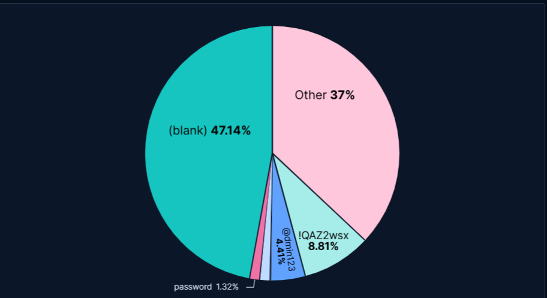

# 🗄️ Threat Hunt: Database Credential Harvesting & `sa` Targeting

* **Date:** March 2026
* **Primary Sensors:** Heralding, Dionaea
* **Targeted Ports:** 1433 (MSSQL), 3306 (MySQL), 5432 (PostgreSQL)
* **Objective:** Unauthorized Database Access & Remote Code Execution

## Executive Summary
During log analysis of the Azure Honeynet's database sensors, I identified highly aggressive, automated credential harvesting campaigns targeting standard database ports. Threat actors heavily targeted Microsoft SQL Server (MSSQL) instances, attempting to brute-force the default System Administrator account to gain total control of the underlying host. 

## 1. Telemetry & Log Analysis
By filtering the SIEM telemetry in Kibana for ports `1433`, `3306`, and `5432`, I captured thousands of targeted authentication attempts. The automated scripts utilized two primary techniques:

1. **Anonymous Binding Probes:** A high volume of `(null)` usernames and passwords were submitted. The automated scripts were attempting to discover unconfigured database instances that allow guest connections without authentication.
2. **Default Administrator Targeting:** The highest volume of targeted attacks aimed at Microsoft SQL Server (Port 1433) utilized the `sa` (System Administrator) username alongside common dictionary passwords (e.g., `sa123456`). 

> *Raw Telemetry: Capturing `(null)` sweeps and targeted `sa` brute-forcing against Port 1433.*

## 2. Password Analytics & Human Behavior
I built a custom pie chart visualization in Kibana to analyze the top passwords utilized by the botnets. The data reveals key threat actor assumptions regarding human password hygiene:

* **The Laziness Factor (47%):** Almost half of all attacks attempted `(blank)` passwords, hunting for totally unsecured deployments.
* **The "Keyboard Walk" (8.8%):** Passwords like `!QAZ2wsx` bypass standard complexity filters (uppercase, lowercase, number, symbol) but are easily guessed by algorithms because they follow a straight line down a physical QWERTY keyboard.
* **Leetspeak Bypass (4.4%):** Threat actors heavily utilized permutations like `@dmin123`, knowing administrators often substitute symbols for letters to meet basic password requirements.

> *SIEM Visualization: Top database password permutations captured by the honeynet.*

## 3. The Threat & Business Impact
If a threat actor successfully compromises the `sa` account on an MSSQL instance, the impact extends far beyond data theft. Threat actors can utilize the built-in `xp_cmdshell` extended procedure to execute arbitrary operating system commands, effectively escalating a database breach into a full server compromise and allowing them to pivot into the internal network.

## Actionable Mitigations
* **Disable `sa`:** The default `sa` account should be disabled or heavily renamed immediately upon MSSQL deployment.
* **Network Segmentation:** Databases should reside on isolated internal subnets and never be exposed directly to the public internet (0.0.0.0/0).
