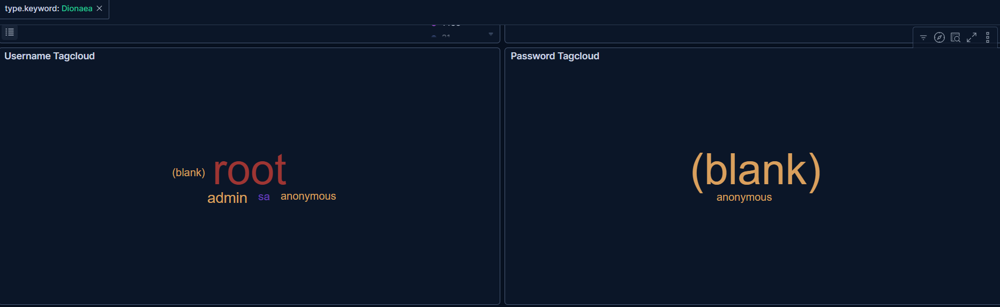

# 🚨 Threat Brief: Unauthenticated File Shares & Malware Droppers

* **Date:** March 2026
* **Analyst:** Thomas Price  
* **Sensor:** Dionaea (Malware Capture Honeypot)
* **Targeted Services:** FTP (TCP/21), SMB (TCP/445), MySQL (TCP/3306), MSSQL (TCP/1433)

> **About Dionaea:** This is the ultimate malware catcher. It simulates vulnerable SMB (Windows File Sharing) and FTP services. If you see activity here, you are likely catching automated ransomware worms (like the infamous WannaCry) trying to spread across networks.

## Overview
Analysis of the Dionaea sensor logs revealed aggressive, automated scanning targeting file transfer protocols and unconfigured databases. Dionaea is designed specifically to capture malware payloads (like ransomware and worms) by simulating vulnerable network services.

## Analysis & Visual Evidence

### Targeted Observation: Anonymous File Share Hunters
Analysis of the attack metadata confirms that automated botnets are actively sweeping for exposed, misconfigured file-sharing protocols. Dionaea captures these attempts on default ports for **FTP (Port 21)** and **SMB (Port 445)**.

> *Credential Analysis: The tag cloud above highlights that `anonymous`, `(blank)`, and `null` are the primary targets, confirming that attackers are hunting for unauthenticated file access.*

### Analysis: Multi-Vector "Shotgun" Scanning
By querying the `Dionaea` index in the Discover tab, I correlated the source IPs with the specific destination ports and credentials they were using, revealing a highly automated and aggressive enumeration pattern.

> *Forensic Logs: The log table above exposes a "shotgun" scanning technique. Single source IPs (e.g., `18.119.11.223`) targeted four distinct ports (21, 445, 1433, 3306) within milliseconds, illustrating how quickly cloud assets are mapped and probed.*

## Threat Intelligence Takeaways
The immediate targeting of SMB and FTP with null credentials underscores the critical danger of exposing internal file-sharing protocols to the WAN.

**Recommended Mitigations:**
1. **Block SMB at the Edge:** TCP Port 445 (SMB) should be explicitly blocked at the perimeter firewall. SMB is designed for local area networks (LANs) and should never be accessible from the public internet.
2. **Secure FTP Configurations:** If FTP must be used, Anonymous login must be disabled, and the service should be transitioned to SFTP (SSH File Transfer Protocol) to ensure encryption and strict authentication.
3. **Database Initialization Audits:** All database deployments (MySQL, MSSQL) must go through a secure initialization script to ensure default blank passwords are removed before network exposure.
