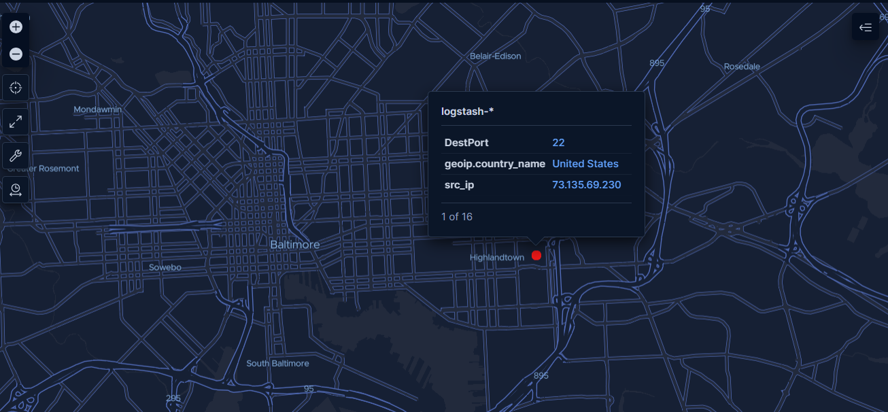
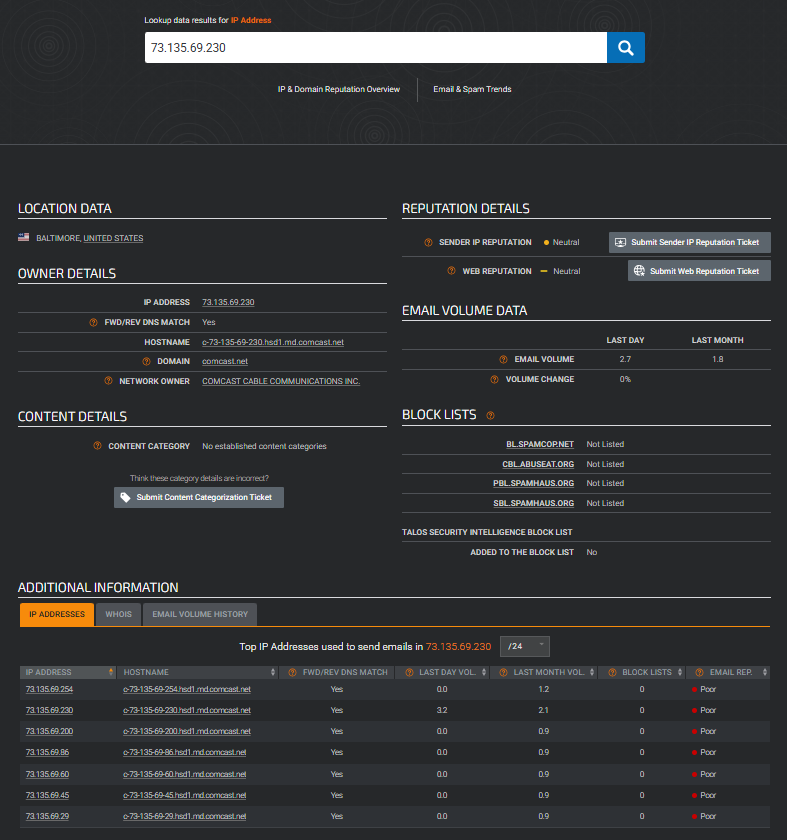

# 🕵️‍♂️ Forensic Deep-Dive: Investigating a Residential Attack Cluster

* **Date:** March 2026
* **Analyst:** Thomas Price  
* **Location:** Baltimore, MD, USA
* **Primary IP Investigated:** `73.135.69.230`
* **Tools Used:** Kibana Maps, Cisco Talos Intelligence, Whois

## 1. Initial Detection & Zoom Analysis
While reviewing the [Global Attack Map](Global_Attack_Map.md), I identified a significant cluster of over 40,000 hits originating from the Mid-Atlantic region of the United States. To move from aggregate data to actionable intelligence, I utilized Kibana’s document-level scaling to "break" the cluster and isolate individual attack points.

> *Geospatial Isolation: Drilling down into a specific SSH (Port 22) brute-force event in Baltimore, MD.*

## 2. OSINT Pivot: Cisco Talos Investigation
I extracted the source IP (`73.135.69.230`) and pivoted to **Cisco Talos Intelligence** for a reputation audit. This step is critical to determine if the attacker is a known malicious actor or a "False Positive."

### Key Findings from Talos:
* **Network Owner:** Comcast Cable Communications Inc.
* **Hostname:** `c-73-135-69-230.hsd1.md.comcast.net`
* **Reputation:** While the high-level category showed "Neutral," the detailed Email Volume metrics flagged the host with a **"Poor" reputation score.**
* **Subnet Analysis:** Looking at the `/24` neighborhood (73.135.69.0/24), I identified **16 different IP addresses** in the same residential block also exhibiting "Poor" reputation scores.

## 3. Threat Profiling: The "Compromised Residential" Hypothesis
The data points toward a **Compromised Residential Host** rather than a professional data center. 

1. **Residential ISP:** The "Comcast Cable" designation suggests this is a standard home internet connection.
2. **Protocol Confusion:** The host was attempting SSH brute-forcing against my Azure sensor. 
3. **Neighborhood Infection:** Seeing 16 different IPs in the same subnet with "Poor" scores suggests a localized malware outbreak. 

**Conclusion:** It is highly probable that these are residential routers or IoT devices (smart cameras, DVRs) that have been recruited into a botnet. The owners likely have no knowledge that their home bandwidth is being utilized for distributed brute-force attacks.

## 4. SOC Analyst Takeaways
* **The "Snowshoe" Strategy:** By using 16+ different IPs in one neighborhood, the attacker can stay under the threshold of many automated blocklists.
* **Validation of Honeynet Data:** This investigation proves that my honeynet is catching "True Positive" malicious activity that matches global threat intelligence from leaders like Cisco.

## Actionable Mitigations
* **Subnet Blocking:** In a production environment, seeing a high volume of malicious hits from a specific residential `/24` subnet justifies a temporary block on the entire range rather than individual "Whack-A-Mole" IP blocking.
* **ISP Abuse Reporting:** High-confidence logs like these can be forwarded to the Comcast Abuse department to help notify the residential customers of their likely compromise.
