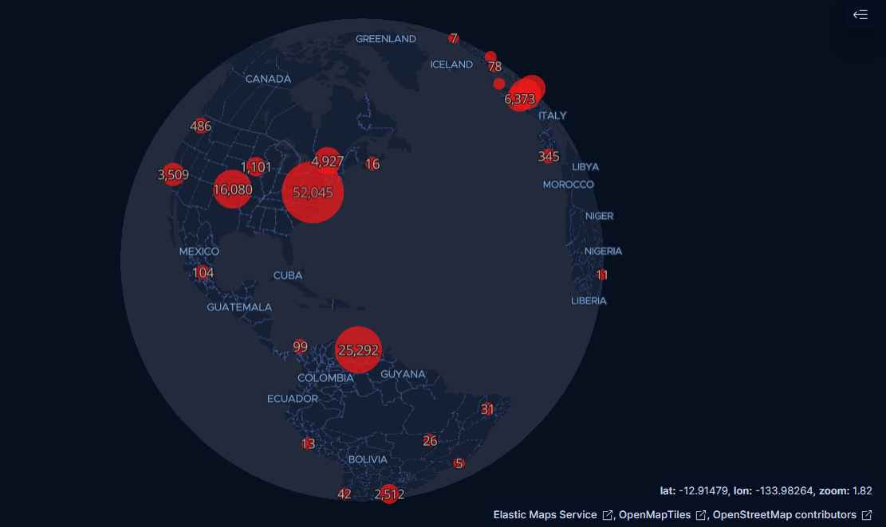

# 🌍 Global Attack Map: Geographic Threat Distribution

* **Date:** March 2026
* **Data Sources:** Dionaea, Cowrie, Heralding (Aggregated)
* **Objective:** Visualizing Threat Origin via GeoIP Enrichment

## Executive Summary
To provide high-level, actionable intelligence regarding the origins of automated attacks against the Azure Honeynet, I built a dynamic Global Attack Map utilizing Kibana's geospatial mapping capabilities. This visualization aggregates thousands of raw security logs and plots them dynamically based on their geographic point of origin.

> *High-Level Distribution: Over 77,000 attacks visualized globally over a 7-day period.*

## 1. The Mechanics: GeoIP Enrichment
Raw network traffic only provides an IP address (e.g., `73.135.69.230`), which inherently lacks geographic context. To build this map, I relied on the SIEM's ingestion pipeline (Logstash). As each attack hits the honeynet, the pipeline intercepts the raw log, extracts the `src_ip`, and queries it against a GeoIP database. The pipeline then enriches the log by appending a new field—`geoip.location`—which contains the physical latitude and longitude of the attacker's ISP.

## 2. Forensic Detail & Tooltips
By utilizing Kibana's "Documents" layer, I can zoom in on specific clusters to isolate individual attack events. This allows for real-time forensic analysis of the source IP, destination port, and country of origin.

> *Forensic Detail: A localized view of an SSH (Port 22) brute-force attempt originating from Baltimore, MD.*

## 3. Threat Intelligence Takeaways
By plotting the enriched data, distinct patterns emerge:
1. **The Residential Swarm:** Massive clusters originate from residential ISPs in Southeast Asia, primarily targeting SMB (Port 445).
2. **The Cloud Scanners:** Secondary clusters map back to major cloud hosting providers (DigitalOcean, AWS) executing automated API reconnaissance scripts.

## Actionable Mitigations
Visualizing attack origins provides a direct business case for **Geo-IP Blocking**. If a business has no legitimate operational need to communicate with high-risk regions, implementing conditional Geo-IP block rules at the perimeter firewall can drop a significant percentage of automated botnet noise.
