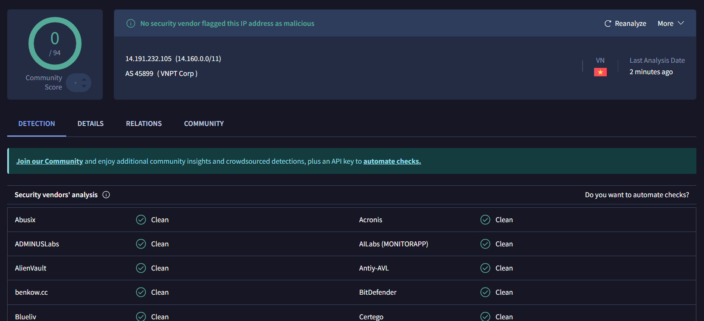

# 🕵️‍♂️ Case Study: Zero-Day Botnet Discovery

* **Date:** March 2026
* **Primary Sensor:** Dionaea 
* **Targeted Protocol:** SMB (TCP Port 445)
* **Threat Classification:** Undetected IoT/Residential Botnet

## Executive Summary
During routine proactive threat hunting within the Azure Honeynet telemetry, an anomalous spike of over 11,000 attacks was detected targeting the Dionaea sensor within a single 24-hour window. Active log analysis and Open-Source Intelligence (OSINT) correlation revealed a coordinated, undocumented botnet operating out of compromised residential infrastructure in Southeast Asia. This case study outlines the methodology used to isolate the threat and highlights the critical danger of relying solely on external threat feeds.

---

## Phase 1: Discovery & Triage (The Alert)
The investigation began with a high-level visual anomaly on the primary Kibana dashboard. Historically, the Cowrie sensor (SSH/Telnet) receives the highest volume of automated attacks. However, telemetry showed the Dionaea sensor (Malware/File Shares) had abruptly overtaken Cowrie, registering an 11,000+ attack spike. 

A review of the **Destination Port Histogram** confirmed that the entirety of this spike was directed at **TCP Port 445 (SMB)**, indicating a massive sweep for unauthenticated Windows file shares, a common precursor to ransomware deployment.

## Phase 2: Log Analysis & Isolation (The SIEM Hunt)
To move from an aggregated visual to raw forensic data, I transitioned to the Kibana Discover tab and isolated the `Dionaea` index. 

Instead of analyzing 11,000 individual events, I aggregated the data by the `src_ip` field to determine if this was a distributed attack (many IPs) or a concentrated attack (few IPs). 

> *SIEM Telemetry: The log aggregation revealed a highly concentrated attack. Just two IP addresses were responsible for over 90% of the entire 11,000+ attack volume, executing a highly aggressive, automated enumeration script.*

## Phase 3: OSINT Research & Attribution (The Deep Dive)
With the source IPs isolated, I pivoted to external Open-Source Intelligence (OSINT) tools to determine their reputation and geographic origin. I queried both IPs against VirusTotal, specifically forcing a live re-analysis to bypass cached historical data and pull the most current network reports.

**Target 1:** `14.191.232.105` (Responsible for 58.2% of attacks)
* **Geolocation:** Vietnam 
* **ASN:** AS 45899 (VNPT Corp - Vietnam Posts and Telecommunications Group)
* **VT Score:** 0/94 Vendors Flagged

**Target 2:** `118.99.115.59` (Responsible for 32.6% of attacks)
* **Geolocation:** Indonesia 
* **ASN:** AS 17451 (BIZNET NETWORKS)
* **VT Score:** 0/94 Vendors Flagged

> *OSINT Evidence: Both IP addresses returned completely clean scores (0/94) across 94 global security vendors at the exact moment they were actively hammering the honeynet with thousands of malicious SMB requests.*

## Phase 4: Threat Profiling & Analyst Conclusion
The OSINT research provided two critical pieces of context:
1. **The Infrastructure:** Both IP addresses belong to major consumer broadband/residential ISPs in Southeast Asia, rather than known cloud hosting providers (like AWS or DigitalOcean).
2. **The Detection Gap:** The 0/94 vendor detection rate indicates that this infrastructure is entirely undocumented by the global security community.

**Conclusion:** This is a coordinated **zero-day botnet**. Threat actors have recently compromised residential routers, smart TVs, or IoT cameras in Southeast Asia and drafted them into a botnet swarm. Because the attack traffic originates from dynamic residential IP addresses rather than known malicious datacenters, it successfully bypassed traditional IP blocklists and threat intelligence feeds.

## Actionable Mitigations
This event highlights a critical Defense-in-Depth principle: Internal SIEM telemetry is the ultimate source of truth. Relying exclusively on external threat feeds would have allowed this active botnet to bypass perimeter defenses undetected.

1. **Edge Filtering:** TCP Port 445 (SMB) must be explicitly dropped at the perimeter firewall. SMB is an internal protocol and should never be internet-facing.
2. **Dynamic Threshold Alerting:** SIEM alerts should be configured to trigger on velocity (e.g., >100 connection attempts to a single port within 60 seconds from a single IP), automatically blacklisting the offending IP regardless of its external reputation score.
3. **Geo-Blocking (Conditional):** If business operations do not require communication with Southeast Asia, implementing conditional Geo-IP blocking at the firewall can significantly reduce the volume of automated botnet noise.
