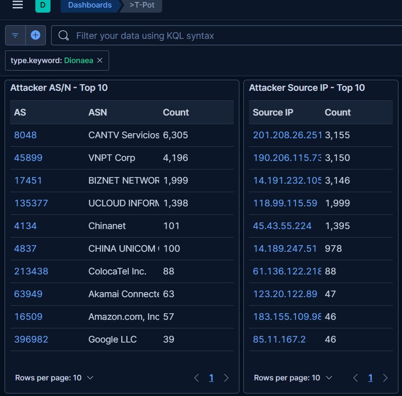

# 🚨 Live Incident Report: Zero-Day Detection (Venezuela)

* **Date:** March 27, 2026
* **Analyst:** Thomas Price  
* **Attacker IP:** `190.206.115.73`
* **Source:** Puerto Ayacucho, Venezuela (CANTV Servicios, state-run/residential ISP)
* **Vector:** Port 445 (SMB) / High-Velocity Automated Scanning Script

## Executive Summary
While monitoring the **T-Pot Live Attack Map**, I identified a high-frequency, automated exploit attempt targeting my **Dionaea (Malware Capture)** honeypot. By immediately pivoting to **VirusTotal** and **Cisco Talos Intelligence**, I confirmed that this IP address had a "Neutral" reputation with no recent analysis. This suggests that the attacker is a newly infected "Zero-Day" bot, and my honeypot captured its malicious activity **before** global threat intelligence platforms had a chance to update their blocklists.

## 1. Initial Detection: T-Pot Live Map
The attack was first observed on the **T-Pot Live Feed** dashboard. This interface provides a real-time, scrolling view of all inbound attacks. 

I identified a single IP from Venezuela (`190.206.115.73`) that was initiating multiple connection requests *per second*. The automated script was repeatedly targeting **Port 445 (SMB)**, which is a classic vector for unpatched Windows vulnerabilities like EternalBlue (MS17-010). 

> *Figure 1: Real-Time Incident. The T-Pot Live Feed captures the aggressive, sub-second frequency of SMB exploit attempts originating from the Venezuelan ISP.*

## 2. OSINT Pivot 1: VirusTotal (VT)
To understand the reputation of this attacker, I immediately queried the IP in **VirusTotal**, an aggregator of over 70 anti-virus engines and blocklists. 

**The result was a "Neutral" score (0/94 detections).** VT showed that this IP was owned by CANTV, Venezuela’s largest state-run ISP, which is a common source of residential and government-owned bots. More importantly, it showed that the last analysis of this IP was conducted over three years ago. This data point is critical: it proves that while the IP itself is old, its malicious activity is brand-new and has not yet been analyzed by the cybersecurity community.

> *Figure 2: VirusTotal Reputation Audit. Despite the live attack, 0/94 security vendors have flagged this IP as malicious, confirming a "First Seen" or Zero-Day event.*

## 3. OSINT Pivot 2: Cisco Talos Intelligence
For a secondary validation, I queried the IP on **Cisco Talos**, one of the largest commercial threat intelligence platforms in the world. 

**The results were identical to VirusTotal.**

Cisco Talos showed a **"Neutral" reputation** and confirmed the owner as CANTV Servicios. Their advanced email and spam metrics had not yet captured any malicious traffic from this host, reinforcing the "Zero-Day" status of this infection. 

> *Figure 3: Cisco Talos Audit. The platform also returns a "Neutral" reputation for the attacker, highlighting the value of internal honeypot telemetry over relying solely on commercial intelligence feeds.*

## 4. SOC Analyst Takeaways
This investigation is a textbook example of a "True Positive" detection where internal behavior outweighs external reputation.

## 5. Statistical Evidence: Dionaea Dashboard Analysis
Deep-dive analysis of the Dionaea sensor telemetry reveals the true scale of this campaign:

* **Top ASN:** AS8048 (CANTV Servicios, Venezuela) accounts for the highest volume of malicious traffic, with over 6,300 unique attack events captured.
* **Primary Target:** Port 445 (SMB) remains the exclusive target of this specific botnet, indicating a focus on unpatched Windows network shares.
* **Sustained Volume:** The IP `190.206.115.73` maintained a top-tier attack volume of over 3,100 events, highlighting the persistence of the automated script.

* **Behavior over Reputation:** Even though the world's most trusted intelligence sources (VT and Talos) called this IP "Neutral," my **Dionaea** honeypot proved its behavior was explicitly malicious.
* **Proactive Defense (Zero-Day):** By identifying this threat before it was blacklisted, I gained "Zero-Day" intelligence. In a real-world SOC environment, this internal data would be used to create an immediate "pre-emptive" block rule on the edge firewall, stopping the attack *before* a broad intelligence update occurred.
* **Compromised Residential Infrastructure:** The assignment to CANTV Servicios heavily suggests this is a compromised residential router or government-owned PC that has been recently recruited into a wide-scale SMB botnet.

## Actionable Mitigations
* **Internal Block List:** This IP address should be added to the internal SIEM and Firewall "High-Risk" blocklists immediately.
* **Honeypot as a "Canary":** This incident demonstrates that a honeypot serves as an excellent "canary in the coal mine," providing early warning of new botnets that have not yet been categorized by major security vendors.
